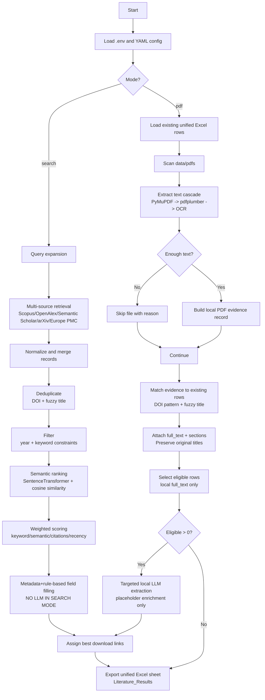

# AI-Assisted Literature Review Engine (Intelligent LCI Maker)

## Status

| Item | Value |
|---|---|
| Project state | In progress and developing phase |
| Collaborators | Mohammadhossein Narang, Hadis Marami, Benyamin Khoshnevisan |
| Contact person | mhna@igt.sdu.dk, bekh@igt.sdu.dk (If you are willing to use BETA version please contact us.)|
| Open-source plan | This repository will be made open source after the scientific papers are published. |

## Tool Overview
This project is a working prototype which already performs end-to-end literature review automation: it accepts configurable research queries, collects records from multiple scholarly APIs, removes duplicates, applies filters, ranks papers with combined scoring logic, runs local LLM extraction for dynamic analysis fields, and exports structured outputs to Excel. The current fertilizer-focused setup is used as a sample prototyping scenario to validate the pipeline against real-world LCA-style search and extraction complexity.

The project is still in the improvement stage and is intentionally evolving. The architecture is domain-flexible, which means the same engine can be used for any topic, title, and study field by changing configuration (queries, keywords, year range, scoring weights, and dynamic headers). Phase 1 is the active implementation today (AI-assisted literature review). Phase 2 will expand this into a larger AI-assisted LCI maker that helps experts draft inventory structures by learning from published studies and linking each suggested element to explicit source evidence.

## Development Status
- Status: Active development
- Delivery stage: Prototype implemented, currently being improved
- Current phase: Phase 1 (AI-assisted literature review engine)
- Next phase: Phase 2 (AI-assisted, citation-grounded LCI maker)

It is a **hybrid retrieval-augmented information extraction pipeline** that combines:
- multi-source literature retrieval,
- deterministic filtering and scoring,
- metadata/rule-based extraction,
- targeted local-LLM extraction only where needed.

A practical shorthand for this architecture is:
- **Retrieval-Augmented Information Extraction (RA-IE)**
- **Hybrid neuro-symbolic pipeline** (rules + embeddings + LLM)
- **Two-stage cascade** (metadata stage, then local-PDF enrichment stage)

## Current Design Principles
The current implementation follows these strict constraints:
1. **Single unified output sheet** in Excel (no split by access type).
2. **Phase 1 (search mode)** uses metadata and rules only (no LLM call).
3. **Phase 2 (pdf mode)** uses LLM only for papers with usable local full-text.
4. Personal identifiers such as email are read from **`.env`**, not from YAML config.
5. Local PDF filenames are helper metadata; they do not replace true study titles in matched records.

## Repository Structure
- `main.py`: entrypoint, mode selection (`search` or `pdf`).
- `engine/search/search.py`: retrieval adapters and source normalization.
- `engine/engine.py`: orchestration, filtering, ranking, extraction, and export.
- `config/user_config.yaml`: study configuration (queries, fields, limits, scoring).
- `data/pdfs/`: user-provided local PDFs for second-stage enrichment.
- `literature_results.xlsx`: generated output workbook.

## Pipeline Overview
The system runs in two operational modes.

### Mode A: `python main.py` (Search Stage, No LLM)
1. Load config and environment variables.
2. Expand queries for higher recall.
3. Retrieve records from configured scholarly sources.
4. Merge and normalize records.
5. Remove duplicates (DOI + fuzzy title).
6. Filter by year and keyword constraints.
7. Rank and score records (semantic + citation + recency + keyword scoring).
8. Populate analysis fields using deterministic metadata/rule-based logic.
9. Export all records into one unified Excel sheet.

### Mode B: `python main.py pdf` (Local PDF Enrichment Stage)
1. Load existing Excel results.
2. Read local PDFs from `data/pdfs/`.
3. Extract text with parser cascade: PyMuPDF -> pdfplumber -> OCR fallback.
4. Match local PDFs to existing studies (DOI-in-filename + fuzzy title).
5. Keep original study titles; attach local full text and section slices.
6. Select only papers with usable local full text.
7. Run local LLM extraction only for those eligible records.
8. Merge enriched fields and export back to one unified sheet.

## Pipeline Schema (Visual)


## Core Methods Used
This project combines several established methods:
1. **Federated retrieval** across multiple scholarly APIs.
2. **Query expansion** for recall improvement.
3. **Deterministic candidate pruning** (year/keyword filters).
4. **Dense semantic ranking** (SentenceTransformers + cosine similarity).
5. **Weighted multi-criteria scoring**.
6. **Entity linkage / record linkage** (DOI normalization + fuzzy matching).
7. **Rule-based information extraction** from metadata.
8. **Retrieval-augmented extraction** from full-text PDFs.
9. **Section-aware extraction routing** for field-specific evidence.
10. **Targeted LLM slot-filling** only in enrichment stage.

## Configuration Guide
Primary file: `config/user_config.yaml`

### `research`
- `description`: semantic intent used for ranking/extraction context.
- `queries`: retrieval expressions sent to source APIs.
- `year_min`, `year_max`, `language`: retrieval constraints.

### `keywords`
- `must_include`: hard relevance terms.
- `optional`: soft relevance boosters.

### `limits`
- `max_initial_results_per_source`
- `max_after_initial_filtering`
- `max_after_filtering`

### `local_llm`
- `enabled`, `model`, `url`
- `not_applicable_text`
- `full_text_retrieval`: parser/extraction controls (`max_pages`, `max_words`, `request_timeout_sec`)

### `excel_export`
- `filename`
- `sheet_name` (single unified sheet)
- `static_headers`, `dynamic_headers`

### `pdf_analysis`
- `enrich_placeholders_only`
- `min_text_chars`

## Environment Variables
Create `.env` in the project root and keep personal/API secrets there.

Common variables:
- `SCOPUS_API_KEY`
- `SEMANTIC_SCHOLAR_API_KEY`
- `OPENALEX_EMAIL`
- `UNPAYWALL_EMAIL`

Note:
- Personal email should not be hardcoded in YAML config.

## Running the System
Install dependencies:
```bash
pip install -r requirements.txt
```

### Search stage (metadata-only extraction)
```bash
python main.py
```

### PDF enrichment stage (targeted LLM)
```bash
python main.py pdf
```

## Output
The pipeline writes `literature_results.xlsx` with:
- one sheet: `Literature_Results`,
- static bibliographic fields,
- dynamic analysis fields,
- clickable download links,
- formatting for readability.

## Practical Notes
1. If local PDFs parse to 0 text, enrichment cannot proceed for those files.
2. OCR requires both Python packages and system OCR runtime.
3. If source PDFs are protected/image-only, extraction quality may degrade.
4. Search mode intentionally avoids LLM to reduce cost/time.

## Limitations
1. Metadata quality depends on source coverage and API responses.
2. PDF extraction quality varies by publisher encoding and document structure.
3. Fuzzy matching may need threshold tuning for some domains.
4. LLM outputs still require expert verification for critical decisions.

## Suggested Next Enhancements
1. Add per-file extraction diagnostics table to Excel.
2. Add confidence-calibrated field audit trail column.
3. Add reproducibility run manifest (config hash + timestamp + source counts).
4. Add optional benchmark mode against manually curated gold labels.

### Pipeline Flow
1. Load runtime config and env variables.
2. Expand each user query to improve retrieval recall.
3. Fetch candidate records from available APIs.
4. Normalize records and merge sources.
5. Remove duplicates by DOI and title similarity.
6. Apply year + keyword filtering.
7. Compute semantic similarity using embedding model.
8. Score records with weighted criteria (keyword/semantic/citation/recency).
9. Run local LLM extraction for dynamic headers.
10. Export to Excel with configured columns and formatting.

## Why We Use APIs and Local LLM Together

### API Layer Rationale
No single source gives complete literature coverage and consistent metadata quality. Multi-source retrieval increases recall and reduces source bias.

- Scopus: strong curated indexing and citation context.
- OpenAlex: broad open access catalog with flexible metadata access.
- Semantic Scholar: complementary metadata and citation coverage.

## How To Create Effective Queries
Use boolean queries that combine:
- concept block A (method or framework),
- concept block B (topic object),
- optional context block C (impact/sustainability/region/time).

### Query Design Pattern
```text
("concept A synonym 1" OR "concept A synonym 2" OR ACRONYM)
AND
("concept B synonym 1" OR "concept B synonym 2")
AND
("context term 1" OR "context term 2")
```

### Example
```text
("life cycle assessment" OR LCA)
AND
("battery recycling" OR "end-of-life battery" OR "lithium-ion recycling")
AND
("resource recovery" OR "emissions" OR "circular economy")
```

## How To Define Keywords and Excel Dynamic Headers

### 1. Keyword Strategy
Use `keywords` to shape filtering behavior before semantic ranking:

- `must_include`: high-priority terms that should appear.
- `optional`: supporting terms that improve ranking but are not mandatory.
- `exclude`: terms to remove obvious out-of-scope papers.

Example:
```yaml
keywords:
  must_include: ["life cycle", "fertilizer"]
  optional: ["slow release", "controlled release", "biochar"]
  exclude: ["policy", "editorial"]
```

For another domain, replace these terms only; pipeline logic stays the same.

### 2. Dynamic Header Strategy (Excel)
Use `excel_export.dynamic_headers` to tell the LLM what analysis fields to produce per paper.

Example:
```yaml
excel_export:
  dynamic_headers:
    - key: summary
      header: Summary
    - key: methodology
      header: Methodology
    - key: key_findings
      header: Key Findings
    - key: system_boundaries
      header: System Boundaries
    - key: impact_categories
      header: Impact Categories
```

Guidance:
- keep header keys short and stable (snake_case),
- use human-friendly `header` labels for Excel output,
- avoid redundant fields that ask the same question in different words,
- keep dynamic fields aligned with your research objective,
- allow `Not applicable` for out-of-scope fields.

## Configuration Walkthrough

### Minimum Required Blocks
`config/user_config.yaml` should define:
- `research`
- `keywords`
- `limits`
- `scoring_weights`
- `local_llm`
- `excel_export`

### Local LLM Block Example
```yaml
local_llm:
  enabled: true
  model: "llama3"
  url: "http://localhost:11434/api/generate"
  apply_to_all_export_rows: true
  not_applicable_text: "Not applicable"
```

## Setup and Run

### Prerequisites
- Python 3.9+
- API keys for at least one source (Scopus optional, Semantic Scholar optional, OpenAlex works with/without email)
- Local model endpoint for dynamic extraction

### Install
```bash
pip install -r requirements.txt
```

### Environment Variables
Create `.env` in project root:

```env
SCOPUS_API_KEY=...
SEMANTIC_SCHOLAR_API_KEY=...
OPENALEX_EMAIL=your_email@example.com
```

### Execute
```bash
python main.py
```

Output file is controlled by `excel_export.filename` (default in this prototype: `literature_results.xlsx`).

## Output Model
The Excel export combines:
- static metadata columns (title, year, source, DOI, citations, score, and related fields),
- dynamic LLM-generated analysis columns,
- formatting improvements for readability (header style, wrapping, width handling).

## Improvement Backlog (Current Step)
- strengthen handling for missing abstracts and sparse records,
- improve dynamic header instruction quality by field type,
- add evaluation metrics for extraction consistency,
- improve explainability for final score composition,
- prepare GUI layer for non-technical users.

## Planned GUI
The planned GUI will make study setup and review easier:
- guided query builder,
- keyword and header designer,
- one-click run and progress indicators,
- review/edit panel for dynamic extraction,
- evidence and citation traceability views,
- export profiles for different study types.

## Future Direction: Any Topic, Any Study Title
This engine is designed for reuse across research fields. Fertilizer is a prototype case. The same workflow can support health, energy, materials, policy, circular economy, and other domains by changing configuration inputs while preserving the core pipeline.

## Contribution
This project is active and evolving. Contributions are welcome for:
- retrieval quality,
- scoring/ranking strategy,
- dynamic extraction reliability,
- observability and evaluation,
- GUI implementation,
- Phase 2 LCI design.

## Disclaimer
This tool assists researchers and experts; it does not replace expert judgment. Outputs should be reviewed before publication, compliance reporting, or decision-making.

## Acknowledgements

This project has received funding from the European Union’s Horizon Europe Research and Innovation programme under AGRO4AGRI (Grant Agreement No. 101130890). Funded by the European Union. Methodes and logics expressed are however those of the author(s) only and do not necessarily reflect those of the European Union or the European Health and Digital Executive Agency (HADEA). Neither the European Union nor the granting authority can be held responsible for them.

🔗 Learn more about the project: [https://agro4agri.eu/]
